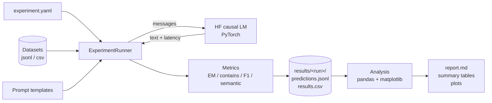

# LLM Evaluation Laboratory

A framework for **systematically benchmarking large language models** across multiple models, prompt templates and question datasets. It runs the full experiment matrix, scores every answer with several metrics, measures latency, saves everything to a run folder, and analyses the results with pandas to expose quality vs performance trade-offs.

Built with **Python, PyTorch, Hugging Face Transformers, pytest and pandas**.

## Features

- **Experiment matrix**: every model x prompt template x dataset combination, defined in one YAML file.
- **Local LLM inference** with Hugging Face Transformers (chat-template aware, greedy decoding by default for reproducibility).
- **Metrics**: exact match, contains-match, token F1 and embedding-based semantic similarity.
- **Latency measurement**: per-answer wall-clock time (with CUDA synchronisation and a warm-up call), new tokens and tokens per second.
- **Result tracking**: each run gets its own folder with the config snapshot, environment info, incremental `predictions.jsonl`, `results.csv` and `summary.csv`.
- **Analysis with pandas**: aggregation per model and prompt, prompt comparison table, Pareto front of quality vs latency, failure cases, plots and an auto-generated Markdown report.
- **Automated tests** with `pytest` (offline, no model downloads).

## How it works



## Project structure

```
llm-evaluation-lab/
├── configs/experiment.yaml      # models, prompts, datasets, generation settings
├── data/
│   ├── general_knowledge.jsonl  # 10 sample questions
│   └── science_basics.jsonl     # 10 sample questions
├── src/llm_eval_lab/
│   ├── config.py                # YAML config + validation
│   ├── datasets.py              # jsonl / csv loading
│   ├── prompts.py               # prompt templates (zero-shot, concise, few-shot)
│   ├── models.py                # Hugging Face model wrapper with latency measurement
│   ├── metrics.py               # EM, contains-match, F1, semantic similarity
│   ├── runner.py                # the experiment pipeline
│   ├── analysis.py              # pandas analysis, plots, report
│   ├── cli.py                   # run / analyze / prompts commands
│   └── utils.py                 # seeding, device selection, environment info
├── tests/                       # pytest suite
├── pyproject.toml
└── requirements.txt
```

## Quick start

**Requirements:** Python 3.10+. Models are downloaded from Hugging Face on first use (roughly 1 GB for Qwen2.5-0.5B-Instruct and 2 GB for TinyLlama-1.1B-Chat).

```bash
git clone https://github.com/2bahaa/llm-evaluation-lab.git
cd llm-evaluation-lab

python -m venv .venv
source .venv/bin/activate          # Windows: .venv\Scripts\activate
pip install -r requirements-dev.txt
```

> CPU only? Install PyTorch first with `pip install torch --index-url https://download.pytorch.org/whl/cpu`.

Run everything from the repository root (dataset paths in the config are relative to it):

```bash
# quick smoke test on 3 examples per dataset
python -m llm_eval_lab.cli run --config configs/experiment.yaml --max-examples 3

# the full experiment
python -m llm_eval_lab.cli run --config configs/experiment.yaml

# re-generate tables, plots and the report for an earlier run
python -m llm_eval_lab.cli analyze --run-dir results/<run_folder>

# list prompt templates
python -m llm_eval_lab.cli prompts
```

## Configuration

```yaml
experiment_name: baseline_small_models
output_dir: results
seed: 42
warmup: true            # one throw-away generation per model, excluded from latency stats
max_examples: null      # cap examples per dataset for quick runs
device: null            # cuda | mps | cpu (auto-detected when null)

models:
  - name: qwen2.5-0.5b
    hf_id: Qwen/Qwen2.5-0.5B-Instruct
  - name: tinyllama-1.1b
    hf_id: TinyLlama/TinyLlama-1.1B-Chat-v1.0

prompts: [zero_shot, concise, few_shot]

datasets:
  - name: general_knowledge
    path: data/general_knowledge.jsonl

generation:
  max_new_tokens: 32
  temperature: 0.0      # 0 = greedy decoding

semantic_model: sentence-transformers/all-MiniLM-L6-v2   # null to skip semantic similarity
```

Any Hugging Face causal LM (or local model path) can be added under `models`. Datasets are `.jsonl` files with `question` and `answers` (a list, or `answer` with alternatives separated by `|`), or `.csv` files with `question,answer` columns.

## Metrics

| Metric                | Definition                                                                                          |
| --------------------- | --------------------------------------------------------------------------------------------------- |
| `exact_match`         | Normalised prediction equals any gold answer (lowercase, no punctuation or articles, SQuAD-style)   |
| `contains_match`      | A gold answer appears as whole tokens inside the prediction, which is fair to chatty models         |
| `f1`                  | Token-overlap F1 against the best-matching gold answer (partial credit)                             |
| `semantic_similarity` | Max cosine similarity between prediction and gold answers, using mean-pooled transformer embeddings |
| `latency_s`           | Wall-clock time of one `generate()` call                                                            |
| `tokens_per_s`        | Newly generated tokens divided by latency                                                           |

Before scoring, the raw output is reduced to its first non-empty line, since small models often keep talking after the answer. The full text is kept in `raw_output` for auditing.

## Outputs

Each run creates `results/<experiment_name>_<timestamp>/` containing:

| File                                            | Contents                                                              |
| ----------------------------------------------- | --------------------------------------------------------------------- |
| `config.yaml`, `environment.json`               | Exact configuration and software / hardware versions for the run      |
| `predictions.jsonl`                             | One line per answer, written immediately so a crash loses no work     |
| `results.csv`                                   | All per-example rows as a DataFrame                                   |
| `summary.csv`, `summary_by_dataset.csv`         | Mean metrics and latency (mean / p50 / p95) per model x prompt (x dataset) |
| `summary_overall.csv`                           | Model x prompt summary with a `pareto_optimal` flag                   |
| `prompt_comparison.csv`                         | Model x prompt table of token F1                                      |
| `tradeoff.png`, `prompt_comparison.png`         | Quality-vs-latency scatter and prompt comparison bar chart            |
| `report.md`                                     | Best configuration, tables and plots in one readable file             |

A configuration is **Pareto-optimal** when no other configuration is at least as good on both F1 and latency and strictly better on one. Those are the sensible candidates when you must trade answer quality against speed.

Use the results directly in pandas:

```python
from llm_eval_lab.analysis import load_results, summarize, failure_cases

df = load_results("results/<run_folder>")
print(summarize(df, by=["model", "prompt"]))
print(failure_cases(df))   # which questions did each prompt miss, and what did the model say?
```

## Extending the lab

**Add a prompt template**

```python
from llm_eval_lab.prompts import PromptTemplate, register_template

register_template(PromptTemplate(
    name="expert",
    system="You are a domain expert. Reply with the answer only.",
    user="Q: {question}\nA:",
))
```

Then add `expert` to `prompts` in the config. The command-line tool only knows the built-in templates, so either add the new template to `_TEMPLATES` in `prompts.py`, or run the experiment from your own script after registering it:

```python
from llm_eval_lab.analysis import analyze_run
from llm_eval_lab.config import load_config
from llm_eval_lab.runner import ExperimentRunner

result = ExperimentRunner(load_config("configs/experiment.yaml")).run()
analyze_run(result.run_dir)
```

**Add a model backend**: implement the small `LLM` protocol from `models.py` (`name`, `generate(messages) -> Generation`, `close()`) and pass a custom `model_loader` to `ExperimentRunner`. This is how the tests run the whole pipeline without real models.

**Add a metric**: write a function in `metrics.py` and include it in `evaluate_prediction`. Every metric column is picked up in `results.csv`. To include it in the summary tables, add it to `analysis.summarize`.

## Testing

```bash
pytest
```

The suite covers metric edge cases, dataset parsing, prompt construction, config validation, the runner (full matrix, incremental tracking, warm-up handling, cleanup when a model crashes) and the analysis and report generation. It uses a scripted stand-in LLM and a toy encoder, so it runs offline in a couple of seconds. The Hugging Face model wrapper and the transformer-based `SemanticScorer` are exercised by running an experiment.

## Design notes

- **Greedy decoding by default**: `temperature: 0` makes runs repeatable, so differences between prompts come from the prompts and not from sampling noise.
- **Fair latency**: a warm-up call removes one-time load and kernel-compilation cost, CUDA is synchronised before and after timing, and metric computation happens outside the timed region.
- **Memory hygiene**: each model is loaded, benchmarked against all prompts and datasets, then freed, so several models fit through one experiment on a single machine.
- **Fail early**: unknown prompt names and invalid configs are rejected before any model is loaded.

## Limitations

- The sample datasets have 10 questions each, which is enough to demonstrate the workflow but far too small for statistically reliable conclusions. Use larger datasets and compare confidence intervals before drawing conclusions.
- Only local Hugging Face causal LMs are supported out of the box. Hosted APIs need a custom backend.
- Latency depends on your hardware, batch size (currently 1) and model precision, so compare numbers only within the same run environment.
- Semantic similarity is an embedding-based proxy. Short answers such as numbers score poorly, so read it next to F1 and contains-match.

## License

MIT. See [LICENSE](LICENSE).

Author: Mohamed Bahaa Madi ([github.com/2bahaa](https://github.com/2bahaa))
